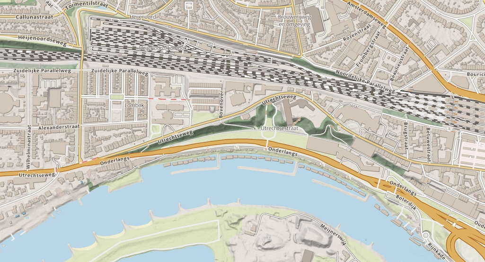
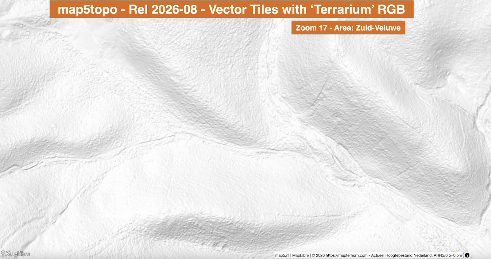

# Vector Tiles

Describes how to use the prepared data to create Vector Tiles (VT). for now a compact description.

{ align=left }

## 1. Data and ETL

The data with SQL schema as used with raster tiling via Mapnik is used. 
The [Martin server](https://martin.maplibre.org/) from the [MapLibre project](https://maplibre.org/) is used as Vector tile server for Vector Tiles and (RGB) DEM/DTM tiles. 

SQL ETL functions make data selections, based on zoomlevel, and create MVT data output. These functions
are configured as Vector Tile Layers, and called in the Martin server.

For example, the Landcover layer `FUNCTION`:

```shell
-- SQL Functions for generating zoom-dependent Vector Tiles
-- Each function gets an x,y,z value in XYZ tiling schema.
-- Zoom (z) in WebMerc is used to only select rows within their indicated (RD) zoom-range.
-- As Zoom WebMerc - 5 equals Zoom in RD.
-- e.g. WebMerc Zoom 18 is NL RD tiling zoom 13 etc. BUT in Vector Tiles zoomlevels start at 0, not 1
-- so WebMerc 18 is 17 in VT etc...

-- landcover polygons
CREATE OR REPLACE
    FUNCTION map5.vt_landcover(z integer, x integer, y integer)
    RETURNS bytea AS $$
DECLARE
  mvt bytea;
  rdz integer := z - 4;
BEGIN
  SELECT INTO mvt ST_AsMVT(tile, 'landcover', 4096, 'geom') FROM (
    SELECT
        ST_AsMVTGeom(
            ST_Transform(geom, 3857),
            ST_TileEnvelope(z, x, y),
            4096, 64, true) AS geom,
        gid,
        lod1,
        lod2,
        lod3,
        area,
        z_index
    FROM map5.landcover
    WHERE (rdz BETWEEN rdz_min AND rdz_max) AND (geom && ST_Transform(ST_TileEnvelope(z, x, y), 28992)) 
  ) AS tile WHERE geom IS NOT NULL ;

  RETURN mvt;
END
$$ LANGUAGE plpgsql IMMUTABLE STRICT PARALLEL SAFE;

```

## 2. Martin Tileserver

The above SQL Functions are configured as layers in the Martin configuration. For example:


```yaml
  # Associative arrays of function sources
  # See tools/etl/sql/map5/vector-tiles.sql for these SQL functions
  functions:
    landcover:
      # Schema name (required)
      schema: map5

      # Function name (required)
      function: vt_landcover

      # An integer specifying the minimum zoom level
      minzoom: 7

      # An integer specifying the maximum zoom level. MUST be >= minzoom
      maxzoom: 17

      # The maximum extent of available map tiles. Bounds MUST define an area
      # covered by all zoom levels. The bounds are represented in WGS:84
      # latitude and longitude values, in the order left, bottom, right, top.
      # Values may be integers or floating point numbers.
      bounds: [ 2.923846, 50.438927, 7.588657, 53.815566 ]

    place:
      # Schema name (required)
      schema: map5

      # Function name (required)
      function: vt_place
    .
    .

```

For testing and inspection, these layers can be called directly, but for production "MBTiles" files are generated, "seeded", and served.

## 3. Tile Seeding

Using `martin-cp`:

```shell
martin-cp --source ${POSTGIS_SOURCES} -c config.yml -o map5.mbtiles --mbtiles-type normalized \
      --bbox ${SEED_BBOX} --on-duplicate ignore --concurrency 8 --min-zoom 5 --max-zoom 17

```

The resulting file can be served directly by Martin via its config:

```YAML
# Publish MBTiles files - available as /map5
mbtiles:
  paths:
    # specific mbtiles file will be published as mbtiles source
    - /martin_cache/map5.mbtiles

```

## 4. HillShade

Using 'terrarium' RGB in PMTiles archive. 
Generated with [Mapterhorn](https://mapterhorn.com) from AHN5+AHN6 source TIFF DTM data.
Work in progress. Note that `justb4` contributes to Mapterhorn project for the AHN5 + AHN6 data.
See the GitHub issue and related [GitHub PR](https://github.com/mapterhorn/mapterhorn/pull/287).

{ align=left }

Eventually the file `map5rgb.pmtiles` (about 95GB) is generated containing both 5m and 50cm AHN data encoded
as RGB tiles in `.webp` format.

In the Martin config this and other `.pmtiles` files can be directly published.

```YAML
## Publish PMTiles files from local disk or proxy to a web server
pmtiles:
  paths:
    # scan this whole dir, matching all *.pmtiles files
    - /martin_cache

```

## 5. Test the Services

Mainly with `MapLibre`. In a MapLibre Style JSON the layers and styles and hillsahde can be specified.

Several services are available.

* Run service stack: `cd services; ./start.sh`
* Local: http://localhost:8000/app/vtiles/maplibre/ (MapLibre)   
* PostGIS data: http://localhost:8000/pgadmin (pgadmin)
* Vector Tiles from Martin: http://vt.local.map5.nl:8000/landcover,transport,transport_area,water,place,structure 
* Production: https://topo.map5.nl/app/vtiles/maplibre/
* Inspection of RGB hillshade: https://topo.map5.nl/app/vtiles/maplibre/map5hill.html
* Inspection (OpenLayers App): https://topo.map5.nl/app/vtiles/inspect/
