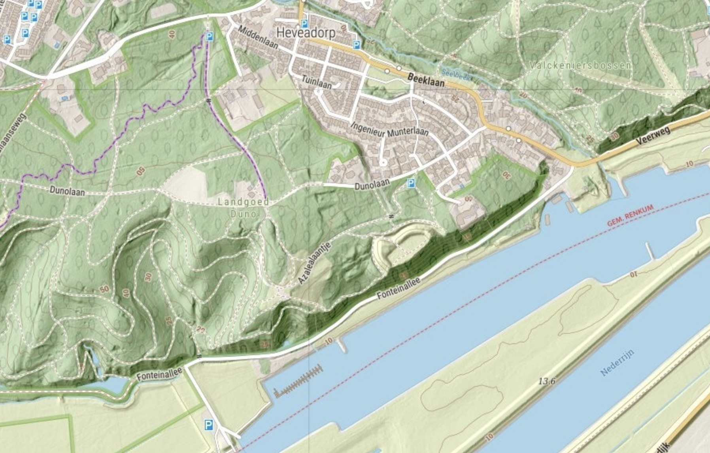

# Maps

Describes how to use the prepared data to create maps. 

{ align=left }

## 1. Mapnik Test

Directly render tiles with Mapnik Python script. Output (JPEG) will be
under `tools/mapnik/output/`.


``` {.bash linenums="1"}

cd tools

# Render multiple tiles at different zooms per category
./mapnik-render-cat.sh  roads | resident | rural

# Render any single tile by zoom, x, y
./mapnik-render-tile.sh  z x y

# Render any map by width,height,bbox (lowerleft, upperright) and style
# Example: 
# ./mapnik-render-map.sh 2000 1000 131000 480000 131500 480500 map-1.png map5topo.xml
./mapnik-render-map.sh  w h llx lly urx ury outfile style

# Advanced: use simple WMS
./mapnik-run-wms.sh 
# then find WMS at http://localhost:8001/fm/wms?REQUEST=GetCapabilities&SERVICE=WMS
# use capitals for WMS query parms!

# OR similar with docker compose
# Mainly for debug: https://www.jetbrains.com/help/pycharm/using-docker-as-a-remote-interpreter.html
cd tools/mapnik
docker compose up

```

## 2. Tile Seeding

Create tile caches (GeoPackages).

During development:

``` {.bash linenums="1"}

# For local quick caching: use ./seed-direct.sh
cd services/mapproxy/seed
# Entire netherlands, NB takes extremely long!
./seed-rd.sh

# Muiden Area, takes about 30mins-1h depending on system
./seed-muiden-rd.sh
```

For production the workflow is more extended: "guarded seed", verify seeded cache, install cache.

``` {.bash linenums="1"}

# For production guarded (some procs may die) caching: use ./seed-guarded.sh
# These create caches under /var/map5/mapproxy/cache/gpkg/<layer>_seed/
# Workflow: first seed, verify cache, then install.

# Single tilecache
./seed-guarded.sh map5topo_rd

# ALL tilecaches:
./seed-all.sh

# Verify tilecache results
./verify-cache.sh <cache> <grid>
# Example
./verify-cache.sh map5topo_seed dutch_grid_lev13

# Install seeded cache
./install-seeded.sh  <cache> <grid>
./install-seeded.sh map5topo dutch_grid_lev13
```

## 3. Test the Services

Several apps are available.

* Run service stack: `cd services; ./start.sh`
* Local: http://localhost:8000/mp (MapProxy) http://localhost:8000/app (apps) http://localhost:8000/pgadmin (pgadmin)
* Fastmap: WMS with Mapnik backend: http://localhost:8000/fm/wms?REQUEST=GetCapabilities
* Production: https://topo.map5.nl/mp https://topo.map5.nl/app
