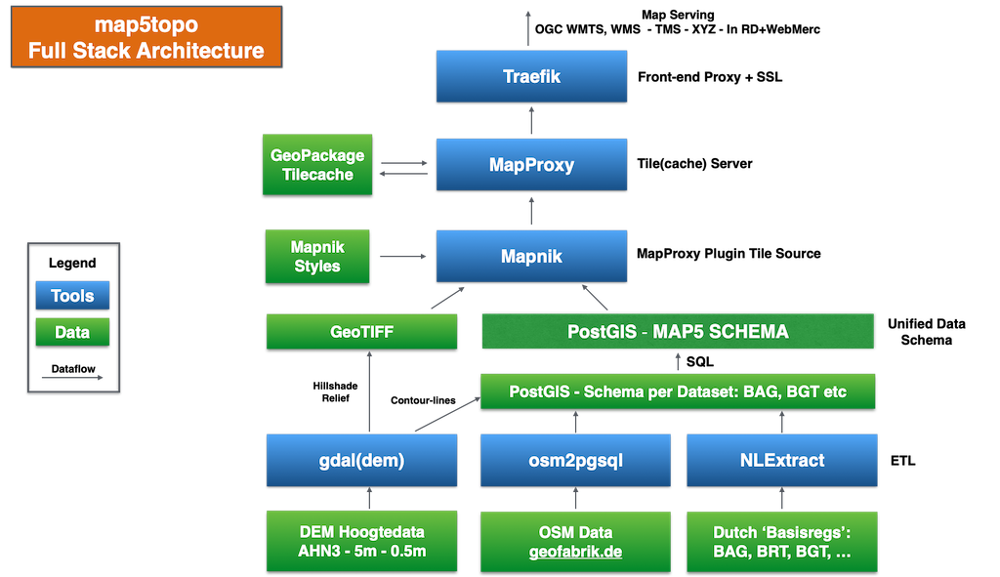

# Architecture

The overall, what may be called, "full stack", high-level architecture, is depicted in the diagram below. (Click on the image to enlarge).

<figure markdown>
{ data-title="map5topo architecture" data-description="This depicts the full stack data-, software- and service- architecture" }
<figcaption>map5topo architecture</figcaption>
</figure>

This figure can best be read through a "follow the data" stream. Arrows denote data flow. Blue boxes tools. Green boxes data.

The main scenario starts at the bottom of the figure.

In short from bottom to top:

* bottom green boxes: raw datasets
* ETL is Extract Transform Load, basically data conversion & transformation from raw to "manageable" data
* ETL: GDAL - `gdaldem` tooling to convert raw DEM height data to hillshade (GeoTIFF)
* ETL: also extract (Vector) Contour lines from DEM and store in PostGIS
* ETL: `osm2pgsql` converts raw OpenStreetMap data files (.pbf) to PostGIS
* ETL: [NLExtract](https://nlextract.nl) converts Dutch Key Registry data, usually GML, to PostGIS
* Unified Data Schema: further expanded in [Data Design Section](data.md), funnels all Vector data into single Schema
* Mapnik is basically a Raster Map Renderer that can operate on various data sources (GTiff, PostGIS, ..)
* Mapnik operates with Mapnik Style files (.xml) later CartoCSS to generate raster map files
* MapProxy is a raster data server that supports a multitude of raster map sources, usually WMS, here Mapnik
* MapProxy can generate so called *Tile Caches* to store rendered map (raster) tiles
* MapProxy+Mapnik also generates *HQ Tiles* also known as *Retina Tiles* with double DPI by scaling to 512*512
* GeoPackage is a versatile, fast and easy to deploy tile cache (single) file format
* MapProxy serves raster maps in a large range of Web Mapping protocols: WMTS, WMS, TMS, "XYZ",..
* Finally Traefik is a front-end HTTP(S) server to the users and apps that consume the map tiles
* Traefik is not only a routing Proxy but also automatically handles/creates/updates SSL certificates using the free Let's Encrypt service
* Just Objects B.V. is a sponsor of Let's Encrypt!
