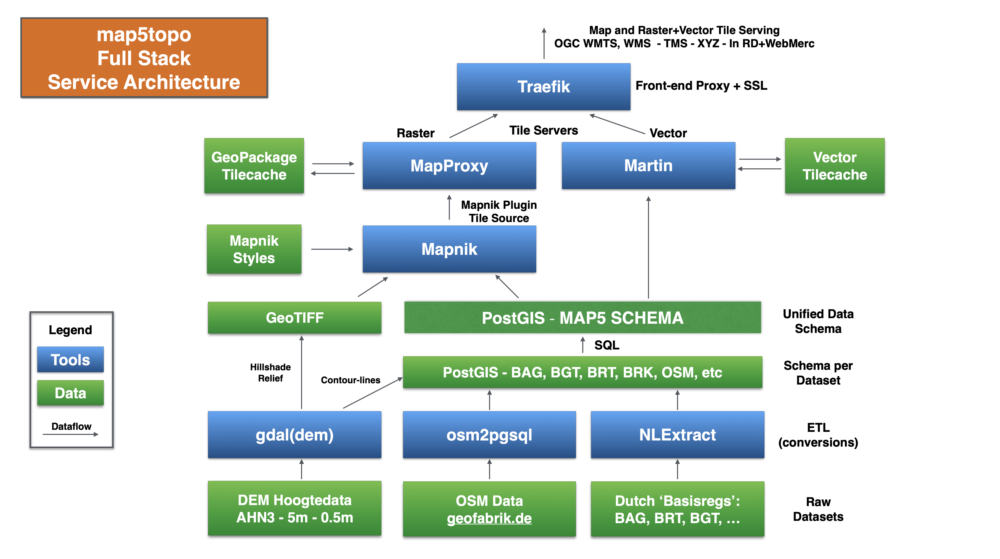

# Architecture

The overall, what may be called, "full stack", high-level architecture, is depicted in the diagram below. (Click on the image to enlarge).
Note that this is the setup for both raster tiles/maps and Vector Tiles. 

<figure markdown>
{ data-title="map5topo architecture" data-description="This depicts the full stack data-, software- and service- architecture" }
<figcaption>map5topo architecture</figcaption>
</figure>

This figure can best be read through a "follow the data" stream. Arrows denote data flow. Blue boxes tools. Green boxes data.

The main scenario starts at the bottom of the figure.

In short from bottom to top:

## Data Stack

This part is common for both Raster and Vector Tiles:

* bottom green boxes: raw datasets
* ETL is [Extract Transform Load](https://en.wikipedia.org/wiki/Extract,_transform,_load), basically data conversion & transformation from raw to "manageable" data
* ETL: [GDAL](https://gdal.org/) - `gdaldem` tooling to convert raw DEM height data to hillshade (GeoTIFF)
* ETL: also extract (Vector) Contour lines from DEM and store in PostGIS
* ETL: [osm2pgsql](https://osm2pgsql.org/) converts raw OpenStreetMap data files (.pbf) to PostGIS
* ETL: [NLExtract](https://nlextract.nl) converts Dutch Key Registry data, usually GML, to PostGIS
* Unified Data Schema: further expanded in [Data Design Section](data.md), funnels all Vector data into single Schema

## Service Stack - Raster Tiles

* [Mapnik](https://mapnik.org/) is basically a Raster Map Renderer that can operate on various data sources (GTiff, PostGIS, ..)
* Mapnik operates with Mapnik Style files (.xml) later CartoCSS to generate raster map files
* [MapProxy](https://mapproxy.org/) is a raster data server that supports a multitude of raster map sources, usually WMS, here Mapnik
* MapProxy can generate so called *Tile Caches* to store rendered map (raster) tiles
* MapProxy+Mapnik also generates *HQ Tiles* also known as *Retina Tiles* with double DPI by scaling to 512*512
* [GeoPackage](https://www.geopackage.org/) is a standardized (OGC), versatile, fast and easy to deploy tile cache (single) file format
* MapProxy serves raster maps in a large range of Web Mapping protocols: WMTS, WMS, TMS, "XYZ",..

## Service Stack - Vector Tiles

Vector Tiles, on the right part in the picture also get their data from the
Unified Map5 PostGIS Schema. A deliberate decision has been made not to derive raster tiles from vector tiles.
(Though this may change in the future). NB this part of the stack is still under development.
Most tools for Vector Tiles come from the [MapLibre ecosystem](https://maplibre.org/), a fork from MapBox.

* [Martin](https://martin.maplibre.org/) from the MapLibre organization is a versatile Vector Tile server
* Martin can use various vector sources: PostGIS (directly) and tilecaches like MBTiles, and PMTiles
* Martin also provides resources such as Fonts, Glyphs to be used in client-side styling
* Not shown: also a "pure" DEM tiling service is used

Per definition, Vector Tile servers do not provide styled images. This is done
in Vector Tile clients like [MapLibre GL JS](https://maplibre.org/maplibre-gl-js/docs/), that are also developed with the project as part of the apps.

## Access Service

This is the top-part and again common for raster and vector tiles.
Here the access point for various standard (OGC) web mapping protocols is provided.

* Finally [Traefik](https://traefik.io/traefik) is a front-end HTTP(S) server to the users and apps that consume the map tiles
* Traefik is not only a routing Proxy but also automatically handles/creates/updates SSL certificates using the free [Let's Encrypt](https://letsencrypt.org/) service
* *Just Objects B.V. sponsors Let's Encrypt!*
