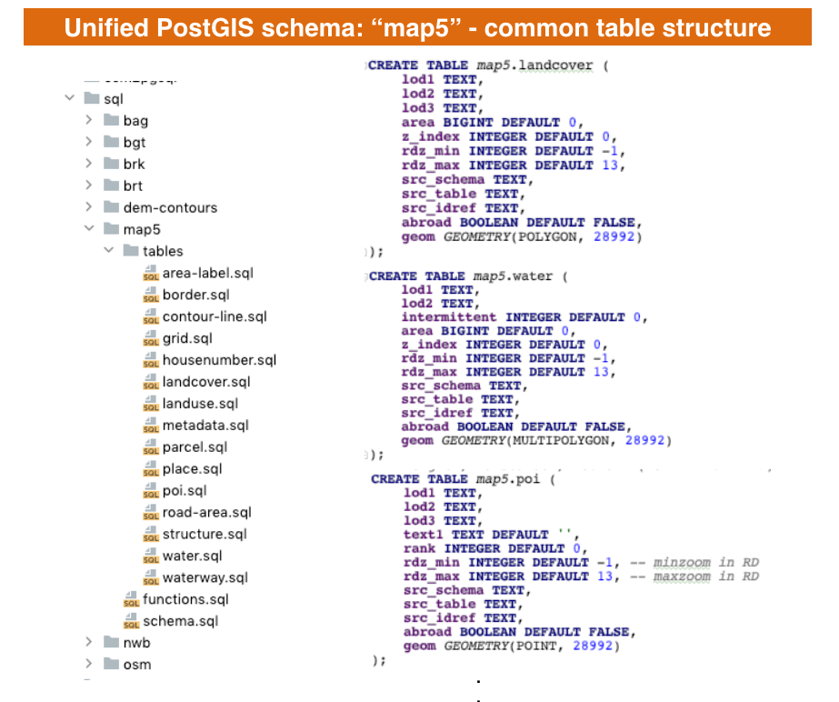
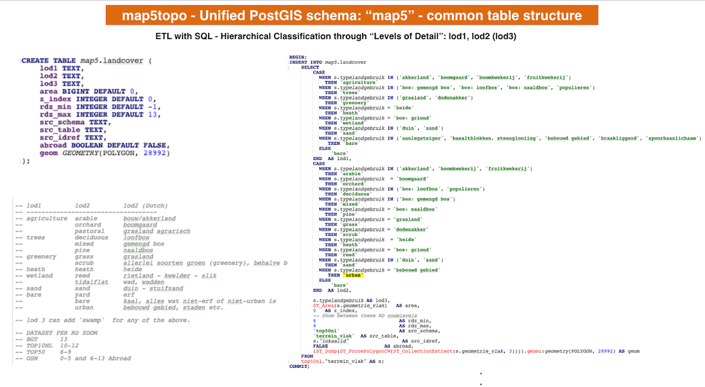
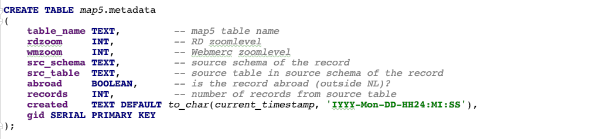
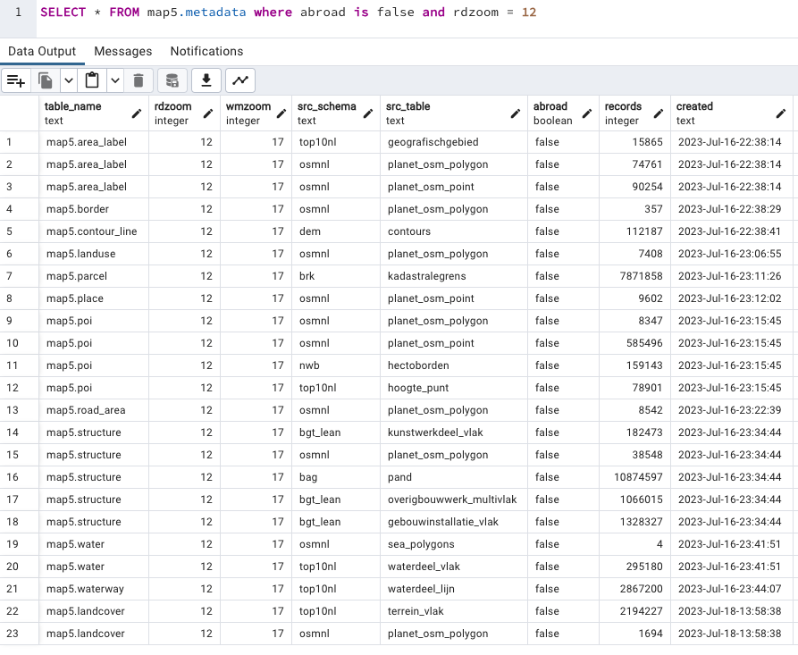

# Data Design

Source Datasets and Data model.

## Intro

map5topo is composed of multiple (open) datasets. The aim is to fit
these all into a single model, (feature) classification and DB-schema.

This is an ongoing process. The name of the (PostGIS) schema is `map5`.
Tables in this schema are filled with data from other schemas/tables that
contain the various (vector) sources like OpenStreetMap, BRT, BRK, BGT, BAG etc.
SQL scripts are used for this transformation.

Inspiration:

* [OpenMapTiles Schema OMT](https://openmaptiles.org/schema/)
* [PDOK Vector Tiles BGT BRT](https://github.com/PDOK/vectortiles-bgt-brt/tree/master/sql)

Both approaches apply hierarchical feature classification: OMT uses `class`, `subclass`, others use
"Level-Of-Detail": `lod1`, `lod2` etc. We like the latter convention as it allows an endless 
hierarchy (and is short to type!).

## Challenges

Although reclassification has been exercised in many mapping projects like the two mentioned above,
the extra challenge here is that completely disjunct datasets are used: Dutch Key Registries (BAG, BGT, BRT etc) and OpenStreetMap.

An additional challenge is that part of the map include neighbouring countries, for which only OSM
and maybe later local datasets, is/are available. The aim is to work with completely integrated
data tables/layers, not seperate layers/styles for neighbouring countries.

## Feature Sets

This is the list of feature sets. Criteria/guidelines:

* Each feature set will be a table. 
* Some tables may expand to multiple Layers. 
* Each feature set/table will always have a single geometry type. 
* Some, like housenumber, which are in effect labels, are separate feature sets because of the sheer set's size. 
* For some names the geometry type is implicit, like 'poi'. 
* No plural naming like `borders`, `parcels`
* Multiple geometry simplifications/generalizations of the same feature may appear in single table
* Hillshade is not table-based, but GeoTIFF raster

The list below is not fixed, subject to change based on new insights, or data items that do not
fit in any set.

* **aeroway**   - aerodromes, aprons, helipads polygons (aeroway lines part of transport_line)
* **area_label** - any polygon that has a name (except house numbers, transport, water)
* **border**  - administrative borders
* **contour_line** - height lines (derived from DEM)
* **grid**  - grid lines in map
* **housenumber**  - clear, also house names
* **landcover**  - mostly ground level earth covering ("aardbedekking")
* **landuse**  - functional use of land, like military areas, graveyards, parks
* **parcel** - cadastral parcels
* **pitch** - sport pitches
* **place** - names of cities, towns up to hamlets
* **poi** - Points of Interest
* **sports_pitch** - special case of landuse, special handling with overlay SVG
* **structure**  - anything human-built from buildings/houses up to civil tech structures
* **structure_line**    - barriers, fences, powerlines
* **transport**         - transport infrastructure: roads, railways, etc
* **transport_area**    - transport infrastructure: polygons
* **transport_label**   - road names and symbols
* **water** - water polygons
* **water_label**  - water names
* **waterway** - water lines

Discussion:

* `aeroway` like aerodromes (polygon) is always a separate feature set, why? Could be in `transport_area`.
* to add to this: aeroway lines are part of `tranport_line`
* think labels can be bundled

## Table Setup

The table-SQL for the ETL 
can be found here: https://github.com/map5nl/map5topo/tree/main/tools/etl/sql/map5/tables.

Each table in the map5 schema has a similar setup, i.e. columns:

```
CREATE TABLE map5.xyz (
    -- table-specific columns, usually classifications, area, population etc 
    (lod1-lod3)
    ..
    ..
    ..
    
    -- COMMON COLUMNS
    --
    
    -- Relative height
    z_index INTEGER DEFAULT 0,
    
    -- min and maxzoom in Dutch RD
    -- when to show an object on the map
    rdz_min INTEGER, 
    rdz_max INTEGER, 
    
    -- Where the data record originates from
    src_schema TEXT,
    src_table TEXT,
    src_idref TEXT,
    
    -- Is the object in NL or outside (abroad)?
    abroad BOOLEAN DEFAULT FALSE,
    
    -- Geometry in Dutch EPSG
    geom GEOMETRY(POINT|POLYGON|LINESTRING, 28992)
);


```

Many tables will contain a classification, like for Landcover or POIs.
For example:

```
CREATE TABLE map5.landcover (
    lod1 TEXT,
    lod2 TEXT,
    lod3 TEXT,
    area BIGINT DEFAULT 0,
    
    -- Common columns
    z_index INTEGER DEFAULT 0,
    rdz_min INTEGER DEFAULT -1,
    rdz_max INTEGER DEFAULT 13,
    src_schema TEXT,
    src_table TEXT,
    src_idref TEXT,
    abroad BOOLEAN DEFAULT FALSE,
    geom GEOMETRY(POLYGON, 28992)
);

```

Here `lod1` through `lod3` provide an *hierarchical* classification of the
feature. This is defined within the project. Each source dataset-specific 
classification is mapped. Usually `lod1` and `lod2` is sufficient. 

For example: `lod1`: `trees`, `lod2: broadleaved|pine|mixed`. `lod3` is usually
the source-specific value like `naaldbos`, mainly for debugging.

The image below summarizes this table design. (Click image to enlarge).

{ data-title="Map5 Schema design and sample tables" align=left }

## Zoom-specific Selection

Each table may contain multiple geometry generalizations (simplifications) 
for the same object. Per record the zoomlevel range
is specified with `rdz_min`-`rdz_max`. Mapnik always provides a `scaledenominator`
when accessing a `Layer`.  Via the SQL Function `rdz()` this scaledenominator is
converted to an RD Zoomlevel (range 1-13, equal to WebMerc 6-18) that is used in the query on that Layer.
This way only the relevant records for that zoomlevel are selected. 
Many zoom-ranges also have VIEWs, for example for analysis. If needed, for performance,
PostgreSQL *materialized VIEWs* may be applied. But at least
data for a single feature type, usually a layer, is not spread over multiple tables now.

For example a VIEW for low-zoom Terrain:

```
CREATE VIEW map5.landcover_z0_z3 AS SELECT
   lc.*
FROM map5.landcover lc WHERE lc.rdz_min >= 0 AND lc.rdz_max <= 3;

```

This also works for Web Mercator tiles as scale-ranges are shared, see e.g.
```
.

.
<!ENTITY maxscale_zoom15_rd10 "<MaxScaleDenominator>20000</MaxScaleDenominator>">
<!ENTITY minscale_zoom15_rd10 "<MinScaleDenominator>10000</MinScaleDenominator>">
<!ENTITY maxscale_zoom16_rd11 "<MaxScaleDenominator>10000</MaxScaleDenominator>">
<!ENTITY minscale_zoom16_rd11 "<MinScaleDenominator>5000</MinScaleDenominator>">
.
.
```

Using these common ranges allows parallel zoomlevels: for example RD level 11 is 16 in Web Mercator.
RD level 13 is WM level 18, the highest level etc.
Usually zoom WM = Zoom RD +5.

## Abroad

The map area includes data from countries both bordering (Germany, Belgium) and in vicinity 
(Northern France) of The Netherlands. By intersecting a (multi)polygon that contains The Netherlands' borders,
in each OSM-record can be marked as located abroad or not This is realized through a simple boolean column, 
aptly called `abroad`. For data from Dutch Key Registries, the fixed `abroad` value is `False`.

## OSM Source Data

OSM data is downloaded from geofabrik.de, and comprises:

```
  # The Netherlands
  https://download.geofabrik.de/europe/netherlands-latest.osm.pbf
  
  # Abroad
  http://download.geofabrik.de/europe/belgium-latest.osm.pbf 
  http://download.geofabrik.de/europe/germany/niedersachsen-latest.osm.pbf 
  http://download.geofabrik.de/europe/germany/nordrhein-westfalen-latest.osm.pbf 
  http://download.geofabrik.de/europe/germany/rheinland-pfalz-latest.osm.pbf 
  http://download.geofabrik.de/europe/france/nord-pas-de-calais-latest.osm.pbf 
  
  # Sea
  https://osmdata.openstreetmap.de/download/simplified-water-polygons-split-3857.zip
  https://osmdata.openstreetmap.de/download/water-polygons-split-3857.zip
```

"The Netherlands" and "Abroad" and stitched together using Osmosis. "Water" data is basically
sea, with exception of Oosterschelde. These are directly converted, using GDAL `ogr2ogr`, to PostgreSQL `PGDump`
files for quick reuse.

## Example Landcover

The image below shows an example for the table `map5.landcover` ("Landcover" and "Landuse" are separated).  

{ data-title="Map5 Schema example for Landcover" align=left }  

The figure shows the table structure and the hierarchical classification: `lod1`  and `lod2` and their values. 
This table is filled from various source tables like BGT and BRT (all "terrain"-related) but also OSM.

Also an excerpt from the `map5.landcover.sql` ETL is shown, for mapping records from BRT Top50NL. 
This mapping is an ongoing process, as the lod-hierarchy needs to be established and mapped
from very different source datasets. Even Dutch Topographic datasets like BRT (smallscale) and BGT (largescale) have
very different feature classification schemes. Also none of the source datasets seems to get the difference
between "Landcover" and "Landuse" right. For example, "orchard" or "graveyard": are these Landcover or Landuse?
This is also an ongoing discussion in the OSM Community, as 
[this recent Landcover proposal](https://wiki.openstreetmap.org/wiki/Proposal:Landcover_proposal_V2) shows.

## Metadata

Each record within tables in the `map5` database schema contains its source schema/table and visibility zoom-range.
This allows for generating metadata such that this information can be made available per zoomlevel, but also other
statistical information like the number of records (at that zoom-level) from a particular source table.

This is exactly what the `map5.metadata` table beholds. As part of the ETL (SQL) that fills `map5.` tables from thir source
schemas/tables, a utility SQL function will also insert (replace) records in `map5.metadata`. The image below shows the 
generic setup.  

{ data-title="Map5 Schema metadata table" align=left }  


<br/>Below an example query: "Show me all information for zoomlevel RD 12 that is not abroad".  


{ data-title="Map5 Schema metadata query" align=left }  
                                                                                                                          
Below is the SQL function called at the end of each `map5.` table generation, that extracts the relevant metadata
records from that table.   


{ data-title="Map5 Schema metadata create records" align=left }  
