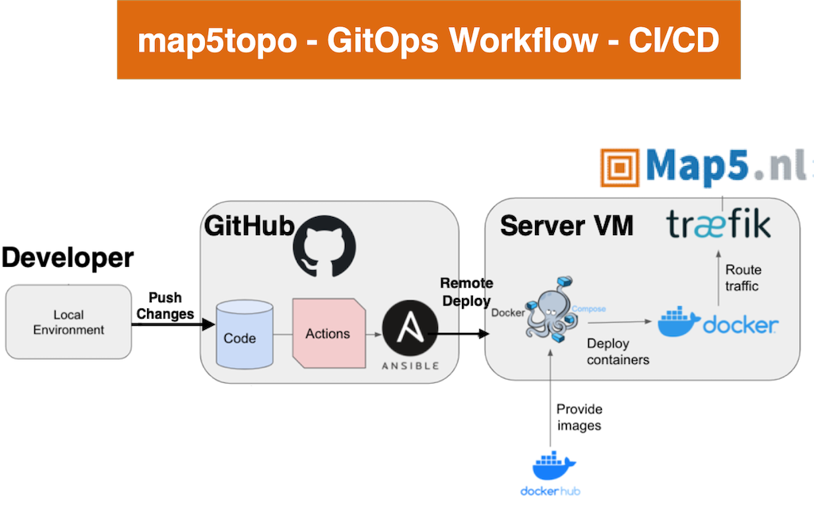

# Deployment

Deployment follows a CI/CD pattern, called "GitOps". This is a continuous integration
where any commit/push to a Git(Hub) repository results in the deployment 
of a new version within a remote server.

<figure markdown>
{ data-title="deployment architecture" data-description="This depicts the deployment rchitecture" }
<figcaption>Deployment architecture</figcaption>
</figure>

This figure applies to the map5topo development CI/CD. 
