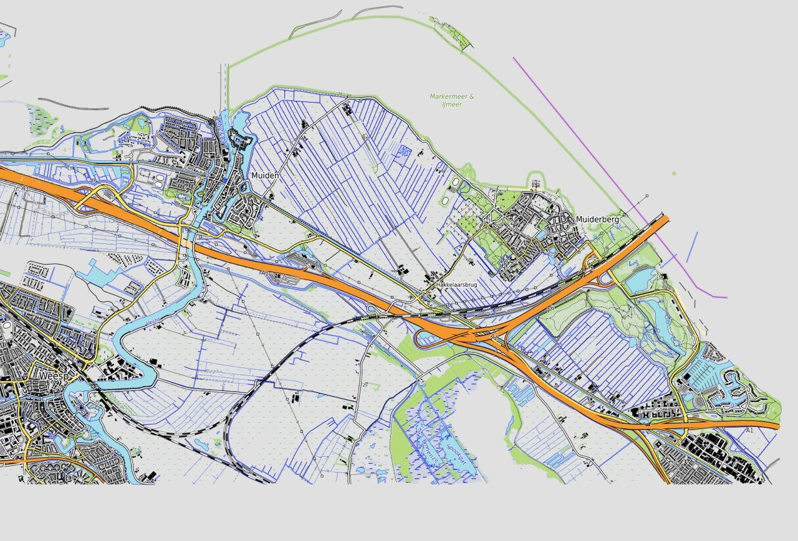

# Gallery - 2022

Work in progress during 2022. Click on the first image to get
a 'Lightbox' slide show with enlarged images.

Below the very first screenshot.

{ data-title="OpenTopoMap" data-description="Official start was on April 22, 2022. OpenTopoMap https://opentopomap.org was taken as starting point." }

{ data-title="220422-wip-1-opentopo" }

{ data-title="220423-wip-1-AHN-50cm" }

{ data-title="220423-wip-OT-AHN5m-AHN-50cm" }

{ data-title="220511-wip-ahn-50cm-z11" }

{ data-title="220511-wip-ahn-50cm-z12" }

{ data-title="220523-wip-rural-z8-15" }

{ data-title="220524-wip-vs-OTM-3857-z15" }

{ data-title="220524-wip-vs-OTM-3857-z16" }

{ data-title="220524-wip-vs-OTM-3857-z17-rdential" }

{ data-title="220524-wip-vs-OTM-3857-z17-rural" }

{ data-title="220630-map5topo-vs-opentopo" }

{ data-title="220703-wip-brk-parcels-z13" }

{ data-title="220706-duno-relief" }

{ data-title="220706-wip-vs-OT-hills" }

{ data-title="220720-new-scaling-ranges" }

{ data-title="220720-wip-vs-OT-z9" }

{ data-title="220804-wip-niene-landcover-z13" }

{ data-title="220804-wip-niene-landcover" }

{ data-title="220804-wip-niene-vs-opentopo-z13" }

{ data-title="220809-wip-current+top10-vs-brt-z10" }

{ data-title="220826-wip-map5topo-vs-ot-z9" }

{ data-title="220829-wip-map5topo-vs-opentopo-rural" }

{ data-title="220831-wip-map5topo-vs-opentopo-pitches-z12" }

{ data-title="220905-wip-map5topo-nieuwsbrief" }

{ data-title="221003-wip-map5topo-gray-z10" }

{ data-title="221003-wip-map5topo_simple-gray-z10" }

{ data-title="221003-wip-map5topo_simple-z10" }

{ data-title="221003-wip-map5topo_simple-z13" }

{ data-title="221005-oosterbeek-full-z10" }

{ data-title="221011-WIP-slide" }

{ data-title="221029-WIP-kadviewer-z9-oosterbeek" }

{ data-title="221029-WIP-mapnik-cats" }

{ data-title="221029-map5topo-resident" }

{ data-title="221029-map5topo-roads" }

{ data-title="221029-map5topo-rural" }

{ data-title="221030-WIP-BGT-roadarea-OSM-lines" }

{ data-title="221108-WIP-sports-pitches" }

{ data-title="221120-wip-oosterbeek-z9" }

{ data-title="221128-bgt-vs-brt" }

{ data-title="221128-map5topo-z10-sbs" }

{ data-title="221128-panden-bag-vs-osm" }

{ data-title="221218-map5topo-vs-simple-z11" }

