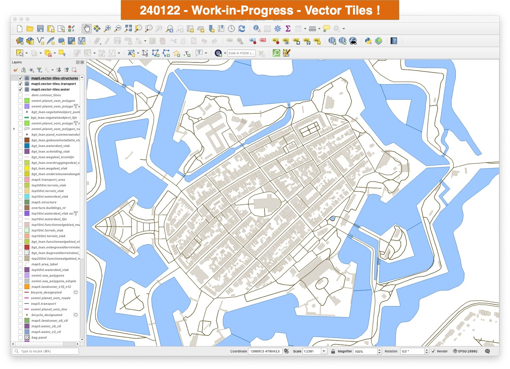
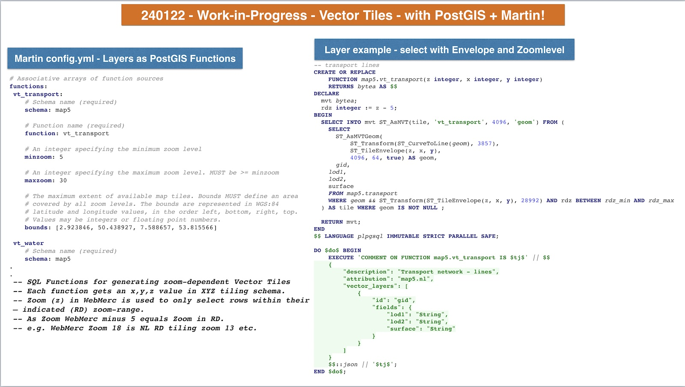

# Gallery - 2024

Work in progress during 2024. Click on the first image to get
a 'Lightbox' slide show with enlarged images.

{ data-title="NEW MAP - map5topo_zero - no labels" }

{ data-title="NEW MAP - map5topo_zero - no labels" }

{ data-title="NEW MAP - map5topo_zero - no labels" }

{ data-title="NEW - Vector tiles, direct from PostGIS map5 schema, rendering in QGIS" }

{ data-title="NEW - Vector tiles, config and PostGIS Functions" }
