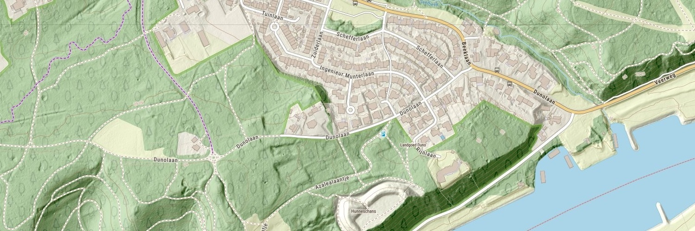

# Welcome to the map5topo website!

{ data-title="Oosterbeek" align=left }

[map5topo](https://map5topo.nl) is a topographic digital map covering The Netherlands plus
parts of bordering countries. The map5topo project started in April 2022 and is ongoing since.

Source data originates from Open Datasets like the Dutch "Key Registries" ("Basisregistraties": BAG, BRT, BGT, BRK, AHN, ...) 
and from OpenStreetMap.
               
map5topo is provided by [map5.nl](https:///map5.nl)
via OGC tiled web services like WMTS, but also "XYZ" (Google/OSM tiles, a.k.a. Web Mercator) tiles. Currently only raster (image) tiles, including "HQ Retina".

This website now covers mainly work-in-progress documentation. Eventually map5topo will be an Open Source project.
At the moment we are cleaning up code and more, as to have a more accessible project. Be patient!

Please see the left-hand navigation for the table of contents.

# Demo

View [map5topo in full](https://app.map5.nl/map5topo/full/) interactively.

# Gallery

Watch work in progress screenshots in the [Gallery](gallery/index.md).

# Newsletter

Stay uptodate through the [Newsletter](https://us10.campaign-archive.com/home/?u=dc76804d91aeb81849bd5071c&id=53b2ade233).
For map5topo developments, start with [Newsletter nr 5](https://us10.campaign-archive.com/?u=dc76804d91aeb81849bd5071c&id=60a3514e90).
(In Dutch, sorry).

# Presentations

map5topo has been presented on several occasions, upcoming is on Sept 25, 2023 at the [FOSS4G-NL-BE](https://foss4g.nl), latest first:

* *"Melting Dutch open data and OpenStreetMap into a single schema"* - [Maptime AMS - September 19, 2024](https://www.meetup.com/maptime-ams/events/301851869) - [\[PDF Slides\]](https://files.justobjects.nl/presentation/maptime-2024/map5-data-maptime-just-2024.pdf)
* *"map5topo - een nieuwe, frisse topokaart van Nederland"* - [OSGeo.nl FOSS4GNL Middelburg - September 14, 2023](https://foss4g.nl) - [\[PDF Slides\]](https://files.justobjects.nl/presentation/foss4gnl-2023/map5topo-foss4gnl-2023.pdf)
* *"Introducing map5topo - a new Topographic Map of The Netherlands"* - Information Sessions - Oktober 5+6, 2022 - Online - Dutch - [\[PDF Slides\]](https://files.justobjects.nl/presentation/map5topo-2022/221005-info-session.pdf)
* *"map5topo - a New Topographic Map of The Netherlands"* - [Geomob Barcelona - November 22, 2022](https://thegeomob.com/post/nov-22nd-2022-geomobbcn-details) - [\[PDF Slides\]](https://files.justobjects.nl/presentation/geomob-bcn-2022/map5topo.pdf) .

# Video

Even more curious? Watch a video presentation of work-in-progress:

# Support

For help and/or questions, send email to our [Helpdesk](mailto:support@map5.nl).
If you find errors or have suggestions, [you can also report directly on GitHub](https://github.com/map5nl/map5issues/issues).
