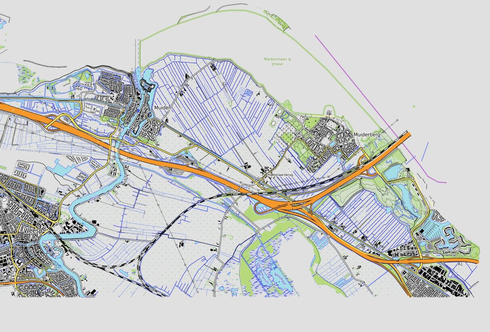
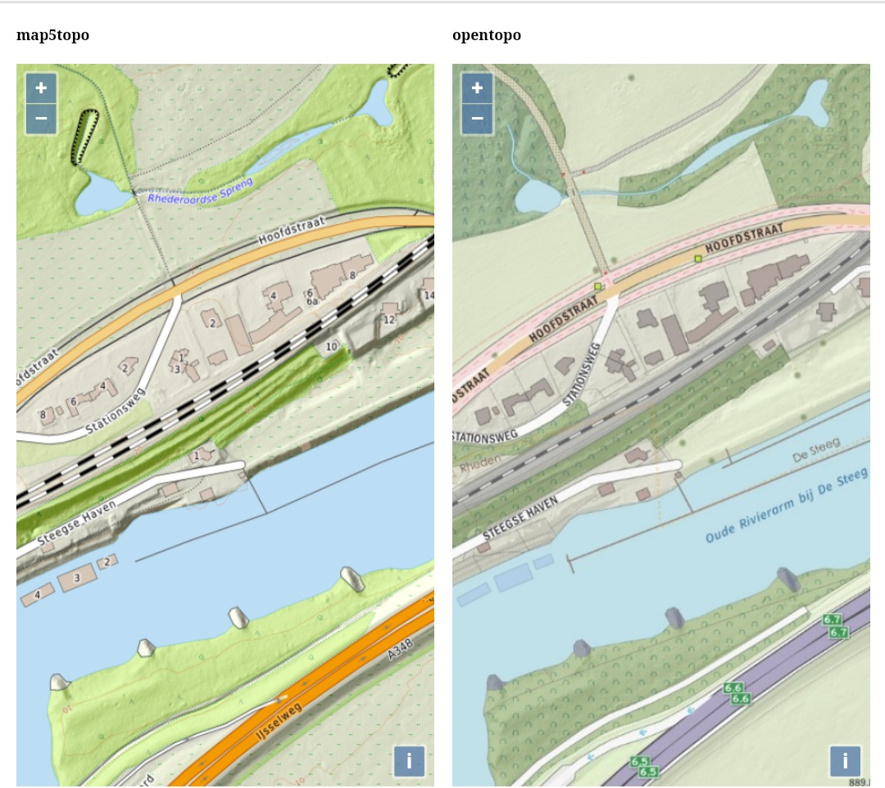
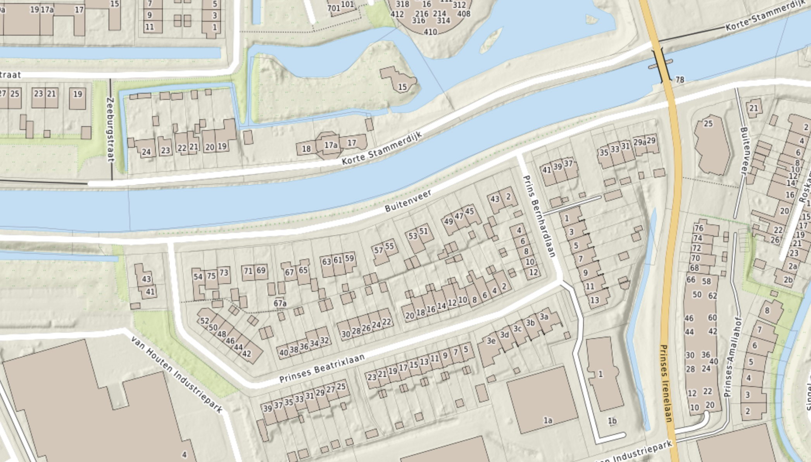
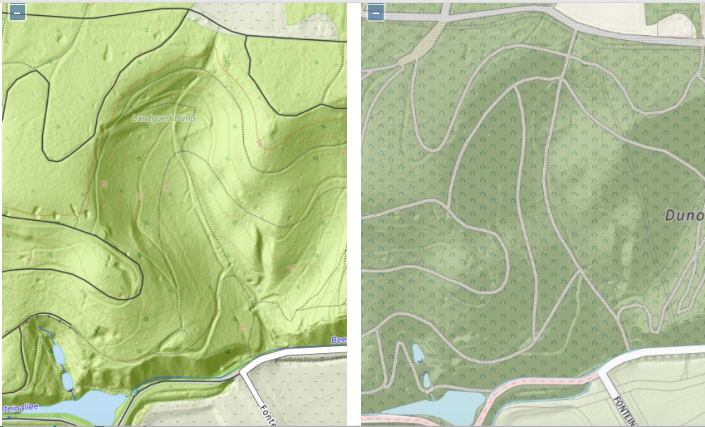

# Logbook

For notes and findings during development. By date YYMMDD.

## 220421

Official start. Take [OpenTopoMap](https://opentopomap.org) as starting point.

First screenshot.

TO BE SUPPLIED

## 220630
       
WIP 

## 220703
       
Adding BRK-DKK parcel borders (perceelgrenzen). Zoom 12 and 13 (screenshot).

## 220706
       
WIP Compare with OpenTopo.

 
## 220726

Adding "aangrenzend buitenland": B, D, Fr (Nord-pas-de-Calias)
