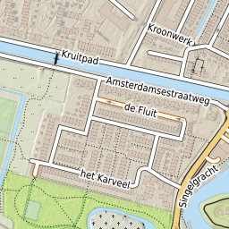
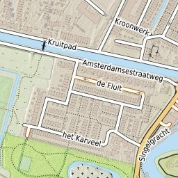
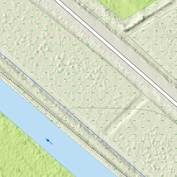
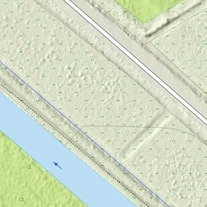

# Research

Initial and ongoing research. 
Initially to come to an optimal toolchain, data and map design.

One of the main questions is: in these modern times, the best starting point would be
Vector Tiles, but...
 
## Vector Tiles

* See https://github.com/mapbox/awesome-vector-tiles, interesting: https://github.com/mkeller3/FastVector, https://github.com/developmentseed/timvt

## Service Toolchain

* `PostGIS` --> `pg_tileserv` --> `tileserver-gl` --> `MapProxy`:

Specifics:

* PostGIS - table data and functions
* `pg_tileserv` - use tables and functions to serve MVT tiles
* NO MVT MBTiles file-caches (for now)
* `maptiler/tileserver-gl` fetches from `pg_tileserv`
* `maptiler/tileserver-gl` renders and serves raster tiles via WMTS
* `MapProxy` uses raster WMTS as Source(s)
* `MapProxy` may use transparent AHN hillshade overlay as Source(s) to overlay
* `MapProxy` creates mbtile-caches for raster tiles (as already in map5.nl)
* alternatives to `pg_tileserv` are FASTVector [5] and TiMVT [6].

Questions:

* is there an (Open) alternative for `tileserver-gl` ? e.g. a tool that directly renders raster tiles from MVT.
* can we do something with maplibre (-native)?
 
## Data Preparation

See Tom van Tilburg article [1]. At least needed:

* feature reclassification for lower zooms
* geometry simplification
* split up (large) polygons

Big question: follow existing OSM/Imposm data schemas or similar to Tom [1] and/or PDOK [2]?
Or can this be solved by using BRT scales like Top1000, Top500 etc?

Many datasets available via geotoko.nl.

## Map Design

* classical topomap look, 
* a simple and detailed version like OpenTopo/OpenSimpleTopo
* coloured and greyscale
* separate hillshading map, bare and with labels+roads
* may use OpenTopoMap [3] as starter?  Classic toolchain: osm2pgsql, SQL and Mapnik
* or https://github.com/nst-guide/osm-liberty-topo  [4]?

Tooling:

* using Maputnik? GeoStyler?
* seems that Mapbox GL/MapLibre GL is CartoCSS follow-up, and can all generate Mapnik styles (?)

## CartoCSS + Kosmtik PoC - 14.07.2022

See `git/research/carto`.

[CartoCSS](https://cartocss.readthedocs.io/en/latest/), 
originally from MapBox, is a higer level styling 
language based on CSS (Less). 
The `carto` command can generate a `Mapnik` XML file. This is 
still used in the main OSM Map, with a style also called "Carto".

[Kosmtik](https://github.com/kosmtik/kosmtik) is mainly a server through which you can quickly see edits
in CartoCSS. It is *not* a CartoCSS editor (as I thought).
But still very useful to see edits, done in e.g. vi.
 
### The Example
 
Very simple example with just water Dutch generalized Shapefile for demo. 
 
* project in work/example1/project.yml.mml.
* style in work/example1/style.mss.
 
### Carto

Using a Dockerfile:

    ./build.sh
    
    Run the carto command to convert a CartoCSS project to Mapnik XML.
    Usage: ./carto.sh "command line"
    Examples:
    ./carto.sh "carto --version"
    
    Files must have a .mss or .mml extension!
    ./carto.sh "carto example1/style.mss"
    ./carto.sh "carto example1/project.yml.mml"
    ./carto.sh "carto example1/project.yml.mml > example1/project.xml" 
 
### Kosmtik

Using an existing Docker Image and Bash script `kosmtik.sh`. 
by https://github.com/Joxit/docker-kosmtik.
 
* script: https://github.com/Joxit/docker-kosmtik/blob/master/tools/kosmtik
* Docker Image: joxit/kosmtik from DockerHub

Thus:

    ./kosmtik.sh serve work/example1/project.yml.mml
    
    browse http://0.0.0.0:6789
    Change polygon color in style.mss, see almost instant changes

## CartoCSS + Topo Style - 15.07.2022

If going the 'CartoCSS' way there is an enormous amount of styles to choose, as starting point.
For example the official OSM slippy map uses a style called 'Carto', which is maintained
by Andy Allan (Gravitystorm and Thunderforest) and community:

* https://github.com/gravitystorm/openstreetmap-carto

Now CartoCSS has many degrees of freedom how one structures the project file and style files.

MapBox developed a CartoCSS style called "OSM Bright" which may be used as a starter
for specific styles:

* https://github.com/mapbox/osm-bright

The nice thing about "OSM Bright" is that it provides a very structured 
file and style editing convention starting with 
the ['project mml](https://github.com/mapbox/osm-bright/blob/master/osm-bright/osm-bright.osm2pgsql.mml) 
which includes just four style (`.mss`) files:

* [palette.mss](https://github.com/mapbox/osm-bright/blob/master/osm-bright/palette.mss) - literally define you palette as symbolic vars: colors fonts etc.
* [base.mss](https://github.com/mapbox/osm-bright/blob/master/osm-bright/base.mss) basic styles for landuse, water, admin boundaries 
* [roads.mss](https://github.com/mapbox/osm-bright/blob/master/osm-bright/roads.mss) - how to style alle roads
* [labels.mss](https://github.com/mapbox/osm-bright/blob/master/osm-bright/labels.mss) - all labels

These styles can be edited with [TileMill](https://tilemill-project.github.io/tilemill/). 
TileMill is more advanced than Kosmik (see above) in that it can provide editing on-the-fly.
But still an export to Mapnik is eventually possible.

One example of a topographic "OSM Bright" based style is:

* https://github.com/duvifn/jnet_style

Not actively maintained, but may be good starting point.

Tilemill: recent, via Docker file: https://github.com/schachmett/docker-tilemill
See: https://simon-fischer.info/2020/12/09/run-tilemill-in-a-docker-container/

## PNG vs JPEG tiles - 17.07.2022

JPEG is a better choice, especially for tiles with lots of detail like hillshading.
This finding also came out of map5 development for the OpenTopo map,
see [Justs Blog on JPEG is Dead, long live JPEG](https://justobjects.nl/jpeg-is-dead-long-live-jpeg/).

A small experiment with the map5topo map gave similar results:

* same image quality
* PNG 8 bit: too low quality for rich coloured map
* **JPEG image about 4 times as small as PNG** (24 bit)
* and: image generation, overall turnaround time in browser: **JPEG twice as fast!**

So the choice is clear: use JPEG but with higher quality in encoding. This
is like with OpenTopo, arranged in MapProxy config:

    # image/transformation options
    image:
    # resampling_method: nearest
    resampling_method: bilinear
    paletted: true
    formats:
      # UNUSED
      png8:
        format: image/png
        colors: 256
    
      png24:
        format: image/png; mode=24bit
        colors: 0
    
      image/jpeg:
        encoding_options:
          jpeg_quality: 90
    

Below some results from tiles in JPEG and PGN24.

Zoom 11:
### PNG

### JPEG

Zoom 13:
### PNG

### JPEG

 

## See changes in Mapnik style files directly

Requirement: need a mechanism to directly see the results in map images 
when changes made in Mapnik style files. Similar to Kosmtik and TileMill.
We can then easily make an HTML page showing images or with a map-viewer that has
permalinks in the address-bar. Or even a primitive edit app!

Our "engine" is MapProxy: it generates map images via WMS, TMS or WMTS
from the Mapnik styles. This is the first choice. 
Investigate
what can be done, otherwise need dedicated software like a WMS server directly on
Mapnik styles. There is 
a [Mapnik OGC Server](https://github.com/mapnik/OGCServer), but would take quite
some effort to get working is expected. Or we need to develop ourselves.
 
But we need to tackle some problems using MapProxy:

* caching: so changes are not visible unless removing cache
* MapFile object reuse: the (enhanced) Mapnik soure backend for MapProxy caches Mapfile objects

The first problem can be solved by making a dedicated "direct" layer in MP config like:

    layers:
        - name: map5topo
        title: Map5 Topomap - powered by map5.nl
        sources: [ map5topo_cache ]
    
        - name: map5topo_direct
        title: Map5 Topomap - direct - no cache
        sources: [ map5topo_no_cache ]
    .
    .
    caches:
    
        map5topo_no_cache:
            grids: [ dutch_grid_lev13, webmerc_grid_lev19 ]
            sources: [ map5topo_source ]
            disable_storage: true
            format: image/jpeg
            meta_buffer: 64
            meta_size: [ 4,4 ]
            upscale_tiles: 4

Now tiles are always newly generated. 

Second problem is caching of Mapnik objects (the parsed XML) in the Mapproxy
[mapnik.py](https://github.com/map5nl/map5topo/blob/main/services/mapproxy/mapnik.py).
We use a file from a MP PR that caches Mapnik objects.
Solution: have that Python code use
[watchdog from pypi](https://linuxhint.com/see-directory-changes-python/).

## Refactor Scale Delineation

This determines the Rules that are 'hit' per scale range. The initial list assumes
Web Mercator scales (at equator 0.28 mm per pixel). This does not match RD scales (resolutions)
defined in the Geonovum tiling scheme. In some cases multiple resolutions will fall in a single
scale range. This may have lead to multiple Rules being fired, maybe that was the reason
for the performance penalty (?).

Like done in Map5 for OpenTopo, TopRaster and more, define scale ranges where each range 
captures a single zoom/resolution for both WebMerc and RD tiling. ALso reflect this in Entity naming.

Original from OpenTopoMap and OSM in general:

    <!ENTITY maxscale_zoom0 "<MaxScaleDenominator>250000000000</MaxScaleDenominator>">
    <!ENTITY maxscale_zoom1 "<MaxScaleDenominator>500000000</MaxScaleDenominator>">
    <!ENTITY minscale_zoom1 "<MinScaleDenominator>200000000</MinScaleDenominator>">
    <!ENTITY maxscale_zoom2 "<MaxScaleDenominator>200000000</MaxScaleDenominator>">
    <!ENTITY minscale_zoom2 "<MinScaleDenominator>100000000</MinScaleDenominator>">
    <!ENTITY maxscale_zoom3 "<MaxScaleDenominator>100000000</MaxScaleDenominator>">
    <!ENTITY minscale_zoom3 "<MinScaleDenominator>50000000</MinScaleDenominator>">
    <!ENTITY maxscale_zoom4 "<MaxScaleDenominator>50000000</MaxScaleDenominator>">
    <!ENTITY minscale_zoom4 "<MinScaleDenominator>25000000</MinScaleDenominator>">
    <!ENTITY maxscale_zoom5 "<MaxScaleDenominator>25000000</MaxScaleDenominator>">
    <!ENTITY minscale_zoom5 "<MinScaleDenominator>12500000</MinScaleDenominator>">
    <!ENTITY maxscale_zoom6 "<MaxScaleDenominator>12500000</MaxScaleDenominator>">
    <!ENTITY minscale_zoom6 "<MinScaleDenominator>6500000</MinScaleDenominator>">
    <!ENTITY maxscale_zoom7 "<MaxScaleDenominator>6500000</MaxScaleDenominator>">
    <!ENTITY minscale_zoom7 "<MinScaleDenominator>3000000</MinScaleDenominator>">
    <!ENTITY maxscale_zoom8 "<MaxScaleDenominator>3000000</MaxScaleDenominator>">
    <!ENTITY minscale_zoom8 "<MinScaleDenominator>1500000</MinScaleDenominator>">
    <!ENTITY maxscale_zoom9 "<MaxScaleDenominator>1500000</MaxScaleDenominator>">
    <!ENTITY minscale_zoom9 "<MinScaleDenominator>750000</MinScaleDenominator>">
    <!ENTITY maxscale_zoom10 "<MaxScaleDenominator>750000</MaxScaleDenominator>">
    <!ENTITY minscale_zoom10 "<MinScaleDenominator>400000</MinScaleDenominator>">
    <!ENTITY maxscale_zoom11 "<MaxScaleDenominator>400000</MaxScaleDenominator>">
    <!ENTITY minscale_zoom11 "<MinScaleDenominator>200000</MinScaleDenominator>">
    <!ENTITY maxscale_zoom12 "<MaxScaleDenominator>200000</MaxScaleDenominator>">
    <!ENTITY minscale_zoom12 "<MinScaleDenominator>100000</MinScaleDenominator>">
    <!ENTITY maxscale_zoom13 "<MaxScaleDenominator>100000</MaxScaleDenominator>">
    <!ENTITY minscale_zoom13 "<MinScaleDenominator>50000</MinScaleDenominator>">
    <!ENTITY maxscale_zoom14 "<MaxScaleDenominator>50000</MaxScaleDenominator>">
    <!ENTITY minscale_zoom14 "<MinScaleDenominator>25000</MinScaleDenominator>">
    <!ENTITY maxscale_zoom15 "<MaxScaleDenominator>25000</MaxScaleDenominator>">
    <!ENTITY minscale_zoom15 "<MinScaleDenominator>12500</MinScaleDenominator>">
    <!ENTITY maxscale_zoom16 "<MaxScaleDenominator>12500</MaxScaleDenominator>">
    <!ENTITY minscale_zoom16 "<MinScaleDenominator>5000</MinScaleDenominator>">
    <!ENTITY maxscale_zoom17 "<MaxScaleDenominator>5000</MaxScaleDenominator>">
    <!ENTITY minscale_zoom17 "<MinScaleDenominator>2500</MinScaleDenominator>">
    <!ENTITY maxscale_zoom18 "<MaxScaleDenominator>2500</MaxScaleDenominator>">
    <!ENTITY minscale_zoom18 "">

This was changed to:

    <!ENTITY maxscale_zoom0 "<MaxScaleDenominator>250000000000</MaxScaleDenominator>">
    <!ENTITY maxscale_zoom1 "<MaxScaleDenominator>500000000</MaxScaleDenominator>">
    <!ENTITY minscale_zoom1 "<MinScaleDenominator>200000000</MinScaleDenominator>">
    <!ENTITY maxscale_zoom2 "<MaxScaleDenominator>200000000</MaxScaleDenominator>">
    <!ENTITY minscale_zoom2 "<MinScaleDenominator>100000000</MinScaleDenominator>">
    <!ENTITY maxscale_zoom3 "<MaxScaleDenominator>100000000</MaxScaleDenominator>">
    <!ENTITY minscale_zoom3 "<MinScaleDenominator>50000000</MinScaleDenominator>">
    <!ENTITY maxscale_zoom4 "<MaxScaleDenominator>50000000</MaxScaleDenominator>">
    <!ENTITY minscale_zoom4 "<MinScaleDenominator>25000000</MinScaleDenominator>">
    <!ENTITY maxscale_zoom5_rd0 "<MaxScaleDenominator>25000000</MaxScaleDenominator>">
    <!ENTITY minscale_zoom5_rd0 "<MinScaleDenominator>12000000</MinScaleDenominator>">
    <!ENTITY maxscale_zoom6_rd1 "<MaxScaleDenominator>12000000</MaxScaleDenominator>">
    <!ENTITY minscale_zoom6_rd1 "<MinScaleDenominator>6000000</MinScaleDenominator>">
    <!ENTITY maxscale_zoom7_rd2 "<MaxScaleDenominator>6000000</MaxScaleDenominator>">
    <!ENTITY minscale_zoom7_rd2 "<MinScaleDenominator>2400000</MinScaleDenominator>">
    <!ENTITY maxscale_zoom8_rd3 "<MaxScaleDenominator>2400000</MaxScaleDenominator>">
    <!ENTITY minscale_zoom8_rd3 "<MinScaleDenominator>1200000</MinScaleDenominator>">
    <!ENTITY maxscale_zoom9_rd4 "<MaxScaleDenominator>1200000</MaxScaleDenominator>">
    <!ENTITY minscale_zoom9_rd4 "<MinScaleDenominator>600000</MinScaleDenominator>">
    <!ENTITY maxscale_zoom10_rd5 "<MaxScaleDenominator>600000</MaxScaleDenominator>">
    <!ENTITY minscale_zoom10_rd5 "<MinScaleDenominator>300000</MinScaleDenominator>">
    <!ENTITY maxscale_zoom11_rd6 "<MaxScaleDenominator>300000</MaxScaleDenominator>">
    <!ENTITY minscale_zoom11_rd6 "<MinScaleDenominator>150000</MinScaleDenominator>">
    <!ENTITY maxscale_zoom12_rd7 "<MaxScaleDenominator>150000</MaxScaleDenominator>">
    <!ENTITY minscale_zoom12_rd7 "<MinScaleDenominator>80000</MinScaleDenominator>">
    <!ENTITY maxscale_zoom13_rd8 "<MaxScaleDenominator>80000</MaxScaleDenominator>">
    <!ENTITY minscale_zoom13_rd8 "<MinScaleDenominator>40000</MinScaleDenominator>">
    <!ENTITY maxscale_zoom14_rd9 "<MaxScaleDenominator>40000</MaxScaleDenominator>">
    <!ENTITY minscale_zoom14_rd9 "<MinScaleDenominator>20000</MinScaleDenominator>">
    <!ENTITY maxscale_zoom15_rd10 "<MaxScaleDenominator>20000</MaxScaleDenominator>">
    <!ENTITY minscale_zoom15_rd10 "<MinScaleDenominator>10000</MinScaleDenominator>">
    <!ENTITY maxscale_zoom16_rd11 "<MaxScaleDenominator>10000</MaxScaleDenominator>">
    <!ENTITY minscale_zoom16_rd11 "<MinScaleDenominator>5000</MinScaleDenominator>">
    <!ENTITY maxscale_zoom17_rd12 "<MaxScaleDenominator>5000</MaxScaleDenominator>">
    <!ENTITY minscale_zoom17_rd12 "<MinScaleDenominator>2500</MinScaleDenominator>">
    <!ENTITY maxscale_zoom18_rd13 "<MaxScaleDenominator>2500</MaxScaleDenominator>">
    <!ENTITY minscale_zoom18_rd13 "<MinScaleDenominator>1250</MinScaleDenominator>">
    <!ENTITY maxscale_zoom19 "<MaxScaleDenominator>1250</MaxScaleDenominator>">
    <!ENTITY minscale_zoom19 "">

Needs testing if this really captures wht is intended. E.g. the Entity 
range  `minscale_zoom10_rd5-maxscale_zoom10_rd5`
schould be the range for WebMerc Zoom 10 and RD 5.

## Refs

* [1] https://observablehq.com/@geodan/how-to-make-a-vectortile-basemap
* [2] https://www.pdok.nl/-/vector-tiles-brt-en-bgt-via-pdok
* [3] https://github.com/der-stefan/OpenTopoMap
* [4] https://github.com/nst-guide/osm-liberty-topo
* [5] https://github.com/mkeller3/FastVector
* [6] https://github.com/developmentseed/timvt 
